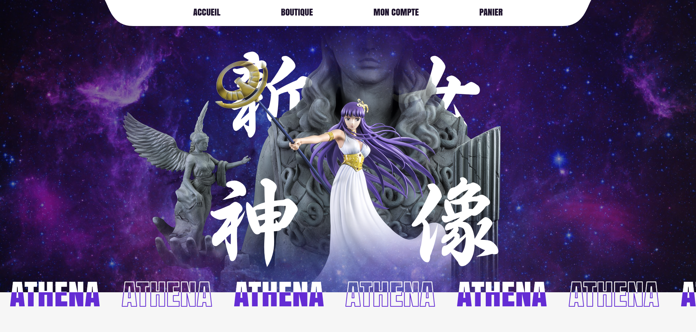

# Projet Angular Final

## Description
Projet réalisé par : 
- Louis LUBINEAU - [@Suylo](https://github.com/Suylo)
- Florent PARIS - [@FlorentParis](https://github.com/FlorentParis)

Ce projet est un site e-commerce de vente de figurines.

## Fonctionnalités : 
- À venir

## Installation

Projet généré avec [Angular CLI](https://github.com/angular/angular-cli) version 16.2.15.

## Development server

Run `ng serve` for a dev server. Navigate to `http://localhost:4200/`. The application will automatically reload if you change any of the source files.

## Build

Run `ng build` to build the project. The build artifacts will be stored in the `dist/` directory.

